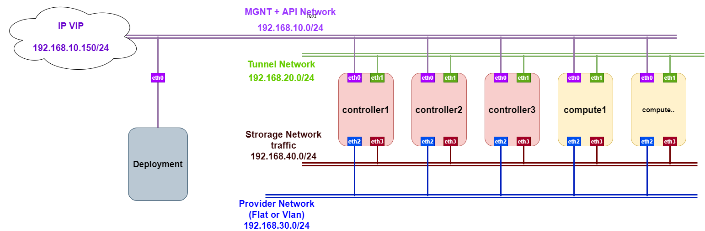

# Deploy-OPS-Ansible
Deploy hệ thống Openstack bằng Ansible

## Khả năng thực hiện
- Deploy hệ thống Openstack Train HA gồm 3 node controller và nhiều node compute
- 4 interfaces network
## Topology



## Các thành phần trong hệ thống
1. Node controller:
 - Chrony
 - Memcache
 - RabbitMQ
 - Mariadb
 - HAproxy
 - Corosync
 - Pacemaker
 - Các project OPS: Keystone, Glance, Placement, Nova, Neutron, Horizon,...
 
2. Node Compute:
 - Chrony
 - Nova-compute
 - Neutron-openvswitch-agent
 
## Yêu cầu cơ bản:
1. Node deployment
- Cài đặt Ansible phiên bản 2.8
- Cài đặt pip
- Cài đặt ipaddr (  Jinja2 filter ) ( pip install netaddr )
- Thực hiện copy ssh-key đến các node cần deploy

2. Node Remote
- Các Interfaces cần sử dụng đã có IP 
- Cài đặt MySQL-python 

## Thực thi 
- B1: copy ssh-key đến các node
- B2: Khai báo các node trong file inventory như [tại đây](https://github.com/vinhducnguyen1708/Deploy-OPS-Ansible/blob/master/multinodeHA) 
- B3: Thực hiện khai báo các thông số về password, interfaces trong file khai báo biến [tại đây](https://github.com/vinhducnguyen1708/Deploy-OPS-Ansible/blob/master/group_vars/all.yml)
- B4: Ping kiểm tra đã kết nối tới các host
```sh
ansible -i multinodeHA all -m ping
```
- B5: Thực hiện Deploy hệ thống
```sh
ansible-playbook -i multinodeHA Deploy_OPS_main.yml
```
hoặc có thể chạy từng role chỉ định bằng cách thêm các tags ở cuối lệnh
```sh
ansible-playbook -i multinodeHA Deploy_OPS_main.yml -t install_rabbitmq
```


