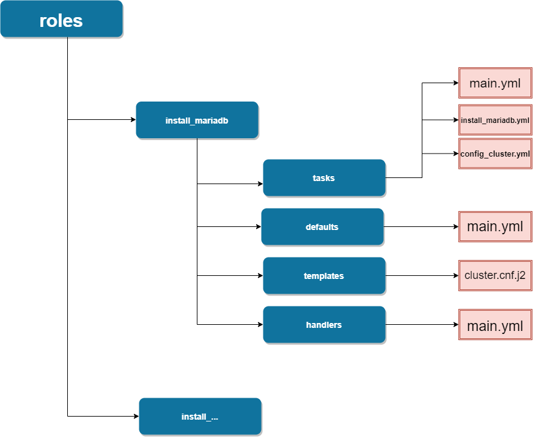

# Role workflow

- Ở đây có khai báo 1 thư mục `roles` là nơi chứa các role được gọi đến trong main playbook.

**Cấu trúc**
- Dưới đây là cấu trúc của 1 role là `install_mariadb` trong thư mục `roles`




**tasks**

- Khi 1 task gọi đến 1 role trong main playbook `Deploy_OPS_main.yml` thì sẽ gọi đến `tasks` trong role đó. 

- Trong thư mục `tasks` sẽ có nhiều các file tasks khác nhau. Vậy nên để Ansible sẽ gọi đến file task `main.yml` đầu tiên.

- Nội dung file `main.yml` 
    ```yaml
    ---
    - include_tasks: install_mariadb.yml 
    - include_tasks: config_cluster.yml
    - include_tasks: config_access_root.yml
    ```
    - file `main.yml` sẽ là task đầu tiên được gọi đến.
    - Nội dung file `main.yml` sẽ có nhiệm vụ gọi lần lượt các tasks khác theo thứ tự được sắp xếp.

**defaults**
- Là thư mục chứa các biến của role.

- Nội dung file `main.yml`:
```yaml
---
mariadb_packages: 
   - mariadb 
   - mariadb-server
   - galera
   - rsync
   - xinetd
   - git
   - MySQL-python

mariadb_repo: 
  - name: MariaDB
  - baseurl: http://yum.mariadb.org/10.2/centos7-amd64 
  - gpgkey: https://yum.mariadb.org/RPM-GPG-KEY-MariaDB
  - gpgcheck: 1
```
- Cách gọi biến: `{{ mariadb_packages }}`
```yaml
### Nếu sử dụng biến
- name: install mariadb
  yum: 
    name: "{{ mariadb_packages }}"
### Nếu không sử dụng biến
- name: install mariadb
  yum:
    name:  
        - mariadb 
        - mariadb-server
        - galera
        - rsync
        - xinetd
        - git
        - MySQL-python
```

- Có thể định nghĩa theo dạng dict-key-value như phần `mariadb_repo`
```yaml
- name: Setup repository
  ini_file:
     path: /etc/yum.repos.d/MariaDB.repo
     section: mariadb
     option: "{{ item.key }}"
     value: "{{ item.value }}"
  with_dict: '{{ mariadb_repo }}
```

**handlers**
- các tasks được định nghĩa trong mục `handlers` thì sẽ được gọi bởi module `notify` trong các tasks chạy ở mục `tasks`
```yaml
### .../handlers/main.yml
- name: start mariadb
  systemd:
    state: started
    name: mariadb
    enabled: yes
### .../tasks/install_mariadb.yml
- name: install mariadb
  yum: 
    name: "{{ mariadb_packages }}"
  notify: 
     - start mariadb
```
- Handlers chỉ chạy khi task chứa notify có sự thay đổi ( status: changed)


**templates**

- Đây là mục chứa các file để cấu hình cho các service hoặc các sript được gửi tới các host client,...

- file jinja2 (đuôi .j2) đây là định dạng file có thể đọc các biến được khai báo 

- Các templates được gọi bằng module `template` trong các tasks
```yaml
- name: Config Mariadb Cluster
  template:
     src: cluster.cnf.j2
     dest: /etc/my.cnf.d/cluster.cnf
  when:
     - groups['controller'] | length  > 1 
```
- Trong đó:
    - src: file nằm trong mục templates trên host deployment
    - dest: đường dẫn đến file ở máy client
    - when: - groups['controller'] | length  > 1: Là module điều kiện, nội dung ở đây là ép kiểu đếm các hosts có trong group `controller` (| lenghth) có giá trị lớn hơn 1 host được khai báo thì task này sẽ được chạy.

    


